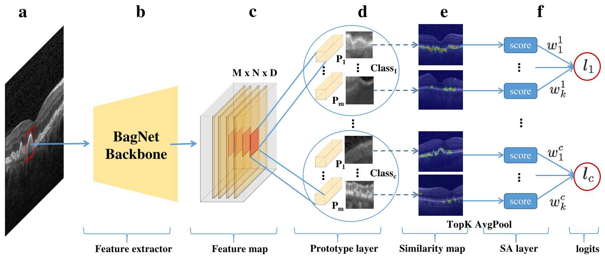

# This really looks like that: Proto-BagNets for local and global glass-box interpretability
This repository contains the official implementation of Proto-BagNets from the paper ["This really looks like that: Proto-BagNets for local and global glass-box interpretability"](https://conferences.miccai.org/2024/en/) (submitted at MICCAI 2024) by ....

## Model's architecture


## Dependencies
All packages required for running the code in the repository are listed in the file `requirements.txt`

## Data
`Dataset`: The code in this repository uses publicly available datasets downloadable here: [OCT Retinal Dataset](https://data.mendeley.com/datasets/rscbjbr9sj/3).

From this dataset, we used a subset containing all the Drusen images and half of the healthy images. The resulting dataset (CSV files) used for training, evaluation, and testing of the model is given: 
- [`test csv file`](./files/csv_files/test_normal_drusen.csv) 
- [`training csv file`](./files/csv_files/train_normal_drusen.csv)
- [`validation csv file`](./files/csv_files/val_normal_drusen.csv)
- [`test lesion annotation csv file`](./files/csv_files/.csv)

The images used for figures 2, 3, and 4 are provided in `./files/images`

## How to use: Training
### 1. Organize the dataset as follows:
```
├── main_folder
    ├── OCT_datset
        ├── test
            ├── Normal  
              ├── Normal-image1.png
              ├── Normal-image1.png
              ├── ...
            ├── CNV
              ├── CNV-image1.png
              ├── CNV-image1.png
              ├── ...
        ├── train
            ├── Normal  
              ├── Normal-image1.png
              ├── Normal-image1.png
              ├── ...
            ├── CNV
              ├── CNV-image1.png
              ├── CNV-image1.png
              ├── ....
    ├── Outputs
      ├── ProtoPNet
      ├── ProtoBagNet      
    ├── train_normal_drusen.csv
    ├── val_normal_drusen.csv
    ├── test_normal_drusen.csv
    ├── test_drusen_annotation.csv
```
Then replace in `configs/default.yaml` the value of
- `paths.root` with path to `main_folder`
- `paths.dset_dir` with path to `OCT_datset`
- `paths.save` with path to `Outputs` to save the model output (logs, model weight, and learned prototypes)
- `paths.model_dir` with path to `ProtoBagNet` or `ProtoPNet` depending on the model you are training

### 2. Update the training configurations and hyperparameters 
Update the training configurations and hyperparameters in: 

 `./configs/default.yaml`

### 3. Run to train
- Create a virtual environment and install dependencies 
```shell
$ pip install requirements.txt
```
- Run a model with previously defined parameters
```shell
$ python main.py
```

### 4. Monitor the training progress 
Monitor the training progress in website [127.0.0.1:6006](127.0.0.1:6006) by running:

```
$ tensorborad --logdir=/path/to/your/log --port=6006
```

## Reproducibility
### Figures and annotations
- Code for figures 2, 3, and 4 may be available upon request
- Annotations masks on selected test images (_test_drusen_annotation.csv_) may also be available upon request

### Models's weights
The final models with the best validation weights used for all the experiments are as follows:
- [ResNet-50 model](https://drive.google.com/file/d/1iaFQ4VVqRw3CbdACaHKfWwuheiAIC7Or/view?usp=drive_link)
- [DenseBagNet model](https://drive.google.com/file/d/1Vsm0CWeL7EKOAjX6TvT1iLJkp7-YCBQk/view?usp=drive_link)
- [ProtoPNet model](https://drive.google.com/file/d/1Hei1HSw2GBavdtAx0uXnun1YxYs2Nti8/view?usp=drive_link) (model weight + learned prototypes with corresponding training extracted images)
- [Prot-BagNet model](https://drive.google.com/file/d/1JO-pOEWQCBo8LoXeWY5XBdBSlLZG83de/view?usp=drive_link) (model weight + learned prototypes with corresponding training extracted images)

### ResNet and dense BagNet code
We used code from the [interpretable-sparse-activation](https://github.com/kdjoumessi/interpretable-sparse-activation) repository to train both the ResNet-50 and dense-BagNet.

## Acknowledge
- This repository contains modified source code from [cfchen-duke/ProtoPNet](https://github.com/cfchen-duke/ProtoPNet) 
- We greatly thanks the reviews of MICCAI 2024 for improving this work.

## Reference
anonymous. Proto-BagNets for local and global glass-box interpretability. Submitted In Medical Image Computing and Computer Assisted Intervention--MICCAI 2024
